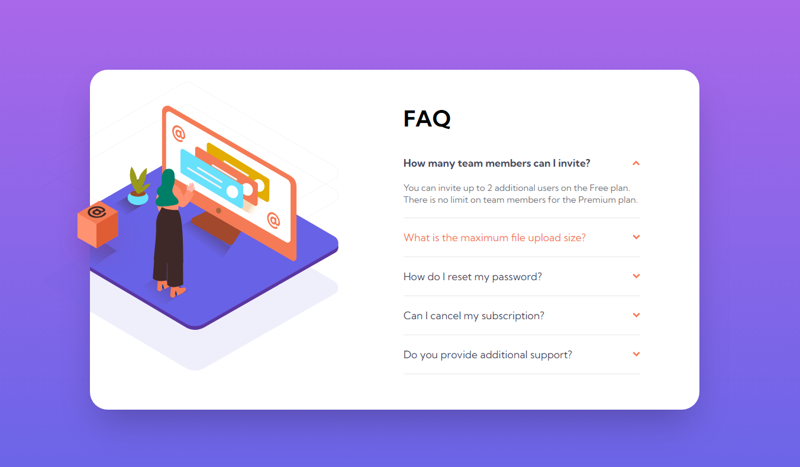

# Frontend Mentor - FAQ accordion card solution

This is a solution to the [FAQ accordion card challenge on Frontend Mentor](https://www.frontendmentor.io/challenges/faq-accordion-card-XlyjD0Oam). Frontend Mentor challenges help you improve your coding skills by building realistic projects.

## Table of contents

- [Frontend Mentor - FAQ accordion card solution](#frontend-mentor---faq-accordion-card-solution)
  - [Table of contents](#table-of-contents)
  - [Overview](#overview)
    - [The challenge](#the-challenge)
    - [Screenshot](#screenshot)
    - [Links](#links)
  - [My process](#my-process)
    - [Built with](#built-with)
    - [What I learned](#what-i-learned)
    - [Continued development](#continued-development)
    - [Useful resources](#useful-resources)
  - [Author](#author)

## Overview

### The challenge

Users should be able to:

- View the optimal layout for the component depending on their device's screen size
- See hover states for all interactive elements on the page
- Hide/Show the answer to a question when the question is clicked

### Screenshot

### Links

- [Live Site](https://faq-accordion-443.netlify.app/)
- [Solution](https://github.com/gpt-anurag/faq-accordion)

## My process

### Built with

- Flexbox
- CSS Grid
- TypeScript
- Vite
- [React](https://reactjs.org/) - JS library
- [TailwindCSS](https://tailwindcss.com/) - For styles

### What I learned

I have used TypeScript, React & TailwindCSS for this project. Most challenging part was positioning the illustration and its elements. To solve this part I added both the illustration and the background in a `div` and added the property `overflow: hidden`. Then gave the box `position: absolute` and positioned it at the required position.

### Continued development

Need to add animation when revealing Accordion content & add animation to the box to give it hover effect.

### Useful resources

- [Slaying the draton](https://www.youtube.com/watch?v=MxEtxo_AaZ4&t=334s) - This youtube video helped me understand positioning elements using CSS.

## Author

- Frontend Mentor - [@gpt-anurag](https://www.frontendmentor.io/profile/gpt-anurag)
- Twitter - [@anurag_2120](https://twitter.com/anurag_2120)
